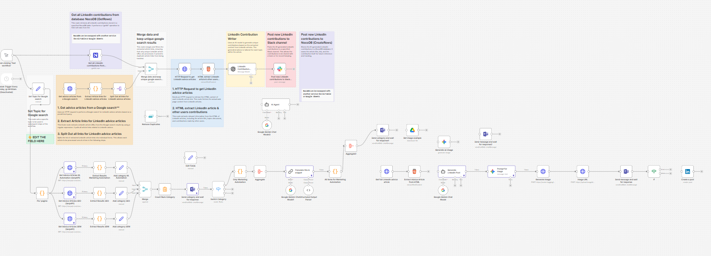

# n8n LinkedIn Top Voice AI Automation

Automazione n8n che scopre articoli LinkedIn Advice, analizza i contenuti e genera contributi originali con l’AI, pronti per essere pubblicati o revisionati.

Pensata per professionisti e creator che vogliono mantenere una presenza costante e di valore su LinkedIn, riducendo al minimo il lavoro manuale.

---

## 🚀 Cosa fa il workflow

1. Cerca automaticamente nuovi articoli LinkedIn Advice tramite Google / SerpAPI  
2. Estrae link unici agli articoli
3. Recupera contenuto HTML dell’articolo
4. Analizza:
   - titolo
   - argomenti trattati
   - contributi di altri utenti
5. Genera contributi **originali e non ripetitivi** tramite AI
6. Invia i risultati a:
   - Slack
   - NocoDB (o Airtable / Google Sheets)

---

## 🧩 Tecnologie utilizzate

- **n8n**
- **OpenAI / Gemini**
- **SerpAPI**
- **Slack API**
- **NocoDB**
- **HTML parsing**
- **Workflow automation**

---

## ⚙️ Setup rapido

1. Importa il file JSON in n8n
2. Configura le credenziali:
   - OpenAI o Gemini
   - Slack
   - NocoDB (opzionale)
   - SerpAPI
3. Modifica il topic di ricerca nel nodo:
   `Set Topic for Google search`
4. Attiva il trigger (manuale o schedulato)

---

## 🔧 Personalizzazioni

- Cambia il topic (marketing, SEO, AI, ecc.)
- Adatta il prompt AI al tuo tone of voice
- Sostituisci NocoDB con Airtable o Google Sheets
- Usa il workflow solo come # n8n LinkedIn Top Voice AI Automation

An advanced n8n workflow that automatically discovers LinkedIn Advice articles, analyzes their content, and generates original, high-quality contributions using AI.

Built for professionals and creators who want to maintain a consistent, valuable presence on LinkedIn without manually searching for articles or drafting responses.

---

## 🚀 What this workflow does

1. Automatically searches for new LinkedIn Advice articles via Google / SerpAPI  
2. Extracts and deduplicates article URLs  
3. Fetches the full HTML content of each article  
4. Analyzes:
   - article title
   - topics discussed
   - existing user contributions
5. Generates **unique, non-repetitive AI contributions** for each topic
6. Sends results to:
   - Slack
   - NocoDB (or Airtable / Google Sheets)

---

## 🧩 Tech stack

- **n8n**
- **OpenAI / Google Gemini**
- **SerpAPI**
- **Slack API**
- **NocoDB**
- **HTML scraping & parsing**
- **AI-powered content generation**

---

## ⚙️ Quick setup

1. Import the workflow JSON into n8n  
2. Configure credentials:
   - OpenAI or Gemini
   - Slack
   - NocoDB (optional)
   - SerpAPI
3. Update the search topic in:
   `Set Topic for Google search`
4. Run manually or enable the scheduled trigger

---

## 🔧 Customization ideas

- Change the search topic (marketing, SEO, AI, SaaS, etc.)
- Adjust the AI prompt to match your brand voice
- Replace NocoDB with Airtable or Google Sheets
- Use the workflow only as a **draft generator** without auto-posting

---

## 📸 Workflow preview

---

## ⚠️ Disclaimer

This project is not affiliated with LinkedIn.  
Use automation responsibly and in compliance with LinkedIn’s terms of service.

---

## 📄 License

MIT
**generatore di draft**, senza posting automatico

---

## 📸 Anteprima workflow

---

## ⚠️ Disclaimer

Questo progetto non è affiliato con LinkedIn.  
Usa l’automazione in modo responsabile e nel rispetto delle policy della piattaforma.

---

## 📄 License

MIT
